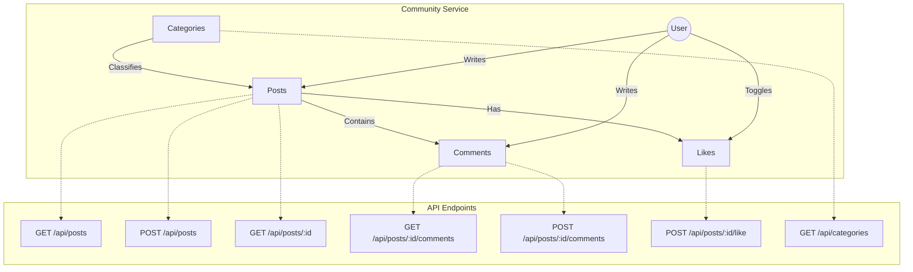

# WeWorkHere 커뮤니티 기능 백엔드 명세서

이 문서는 프론트엔드의 커뮤니티 기능(게시판, 댓글, 좋아요 등)을 구현하기 위해 필요한 백엔드(FastAPI + SQLAlchemy)의 데이터 모델과 API 엔드포인트를 정의합니다.

## 커뮤니티 기능 구조도



---

## 1. 데이터 모델 (Database Schema)

### 1.1 Users (사용자)
*프론트엔드 연동: `useAuth.ts`, `User` 타입*
- `id`: Integer (PK)
- `nickname`: String (익명 닉네임)
- `session_token`: String (인증 토큰)
- `created_at`: DateTime

### 1.2 Categories (카테고리)
*프론트엔드 연동: `PostForm.tsx`, `CategoryFilter.tsx`*
- `id`: Integer (PK)
- `name_ko`: String (한국어)
- `name_en`: String (영어)
- `name_vi`: String (베트남어)
- `name_ne`: String (네팔어)

### 1.3 Posts (게시글)
*프론트엔드 연동: `PostList.tsx`, `PostForm.tsx`*
- `id`: Integer (PK)
- `category_id`: Integer (FK -> Categories.id)
- `author_id`: Integer (FK -> Users.id)
- `title`: String (제목)
- `content`: Text (내용)
- `view_count`: Integer (Default: 0)
- `like_count`: Integer (Default: 0)
- `created_at`: DateTime
- `updated_at`: DateTime

### 1.4 Comments (댓글)
*프론트엔드 연동: `CommentSection.tsx`*
- `id`: Integer (PK)
- `post_id`: Integer (FK -> Posts.id)
- `author_id`: Integer (FK -> Users.id)
- `content`: Text (내용)
- `created_at`: DateTime

### 1.5 PostLikes (좋아요 - Optional)
*프론트엔드 연동: `PostList.tsx`의 하트 아이콘*
- `user_id`: Integer (FK)
- `post_id`: Integer (FK)
- *(Composite PK: user_id + post_id)*

---

## 2. API 명세 (API Endpoints)

### 2.1 카테고리 (Categories)
| Method | Endpoint | 설명 | Request Body | Response |
| :--- | :--- | :--- | :--- | :--- |
| `GET` | `/api/categories` | 모든 카테고리 목록 조회 | - | `List[Category]` |

### 2.2 게시글 (Posts)
| Method | Endpoint | 설명 | Request Body | Response |
| :--- | :--- | :--- | :--- | :--- |
| `GET` | `/api/posts` | 게시글 목록 조회 (페이지네이션, 필터) | Query: `page`, `limit`, `category_id` | `List[PostSchema]` |
| `POST` | `/api/posts` | 게시글 작성 | `title`, `content`, `category_id` | `PostSchema` |
| `GET` | `/api/posts/{id}` | 게시글 상세 조회 | - | `PostDetailSchema` |
| `PUT` | `/api/posts/{id}` | 게시글 수정 (작성자 본인만) | `title`, `content`, `category_id` | `PostSchema` |
| `DELETE`| `/api/posts/{id}` | 게시글 삭제 (작성자 본인만) | - | `{"success": true}` |

### 2.3 댓글 (Comments)
| Method | Endpoint | 설명 | Request Body | Response |
| :--- | :--- | :--- | :--- | :--- |
| `GET` | `/api/posts/{id}/comments` | 특정 게시글의 댓글 목록 조회 | - | `List[CommentSchema]` |
| `POST` | `/api/posts/{id}/comments` | 댓글 작성 | `content` | `CommentSchema` |
| `DELETE`| `/api/comments/{id}` | 댓글 삭제 | - | `{"success": true}` |

### 2.4 상호작용 (Interactions)
| Method | Endpoint | 설명 | Request Body | Response |
| :--- | :--- | :--- | :--- | :--- |
| `POST` | `/api/posts/{id}/like` | 게시글 좋아요 토글 | - | `{"liked": boolean, "count": int}` |

---

## 3. Pydantic Schemas (데이터 교환 형식)

백엔드 개발 시 참고할 요청/응답 스키마 구조입니다.

```python
# Create Post Request
class PostCreate(BaseModel):
    title: str
    content: str
    category_id: int

# Post Response (List Item)
class PostResponse(BaseModel):
    id: int
    title: str
    content: str  # 목록에서는 요약본일 수 있음
    author_nickname: str
    category_name: str # 클라이언트 언어 설정에 맞춰 백엔드나 프론트에서 처리
    like_count: int
    comment_count: int
    created_at: datetime

# Comment Response
class CommentResponse(BaseModel):
    id: int
    content: str
    author_nickname: str
    created_at: datetime
```

## 4. 프론트엔드 요구사항 요약
1. **인증 미들웨어**: 모든 `POST`, `PUT`, `DELETE` 요청은 헤더에 `Authorization: Bearer {session_token}`이 포함되어야 하며, 백엔드는 이를 통해 `current_user`를 식별해야 합니다.
2. **다국어 카테고리**: 카테고리 API는 가능한 모든 언어 버전을 내려주거나, 요청 헤더(`Accept-Language`)에 따라 적절한 언어를 내려주어야 합니다. (현재 프론트엔드는 모든 언어 데이터를 받아 클라이언트에서 선택하는 방식 선호)
